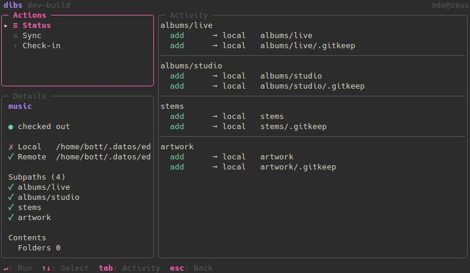

# dibs


A CLI utility to **check out** and **check in** work directories over network drives
(e.g. a locally-mounted Samba/NAS share) or rsync endpoints (`ssh://`, `rsync://`),
using `rsync` to copy files between a remote root and a local working copy, and leaving
a marker behind so others can see a folder is checked out and by whom.

## Install

### macOS (Homebrew)

A macOS cask is published to the
[candy-tools/homebrew-tap](https://github.com/candy-tools/homebrew-tap) tap on every
tagged release. Add the tap, then install:

```bash
brew tap candy-tools/tap
brew install --cask dibs
```

`rsync` is pulled in as a dependency, and `brew upgrade` will track future releases.

### Debian / Ubuntu

Download the `.deb` for your architecture from the
[releases page](https://github.com/candy-tools/dibs/releases) and install it
(this also pulls in `rsync`):

```bash
sudo apt install ./dibs_*_amd64.deb
```

### Other

Grab a prebuilt `tar.gz` archive from the
[releases page](https://github.com/candy-tools/dibs/releases).

## Usage

The workflow is: **checkout** (claim the remote folder with a marker — no files move),
**sync** (pull the tree down; later, push your work back), work locally, **sync** again,
and **checkin** (verify everything is synced, then release the marker).

```bash
dibs checkout work            # lock the "work" profile (run sync to pull files)
dibs sync work                # pull the remote down / push local changes back
dibs status work              # preview what the next sync would do (read-only)
dibs checkin work             # verify fully synced, then release the lock
```

### Commands

- **`dibs checkout <profile> [relpath]`** — write the per-profile marker (the cooperative
  lock) on the remote and record an empty local baseline. No files are copied — that is
  `sync`'s job. `relpath` narrows what later syncs cover; the lock is always the whole
  profile. Re-running on a profile this machine already holds *widens* the covered set.
  `--force` overrides a lock held by someone else (with a loud warning naming the holder);
  it never bypasses the "local target must be empty" guard.

- **`dibs sync <profile> [relpath]`** — the single data-moving command: a three-way
  reconcile of local and remote against the checkout baseline. One-sided changes are
  pushed or pulled; a file changed on *both* sides is a conflict and stops the sync
  without writing either version (`--force` resolves conflicts local-wins — it never
  overrides the lock check).

  Deletions are opt-in per run: without `--allow-deletes` every planned deletion is
  skipped and reported as *pending* (transfers still apply; nothing is ever removed) —
  re-run with the flag to carry them out. Even then, a plan that would delete **all**
  previously synced files on one side (e.g. an emptied or unmounted folder) is refused
  unconditionally; nothing waives that wipe valve.

- **`dibs status <profile>`** — read-only preview of what a sync would do (pushes, pulls,
  deletions, conflicts), grouped per subpath, plus the checkout/baseline state. Uses the
  same engine as `sync`, so the preview and the action never diverge.

- **`dibs checkin <profile>`** — verify local and remote are fully in sync (same engine,
  read-only), then remove the marker and local state. Refuses and lists the pending
  changes if anything is unsynced — run `sync` first. There is no `--force`. `--clean`
  additionally removes the local working copy after a successful release; `--abandon`
  releases the lock *without* the in-sync check (the "start over" path — unsynced local
  work is knowingly left behind, the remote is untouched).

- **`dibs init`** — write a starter config file if none exists.
- **`dibs list`** — print the configured profiles as plain text.
- **`dibs version`** — print version/build information.

Every mutating command takes `--dry-run` (show the plan, change nothing);
`--config <path>` selects an alternate config file.

### TUI

Running `dibs` with no arguments opens an interactive TUI that manages profiles and runs
all of the actions above:

- `a` — add a profile, `e` — edit, `d` — delete (with confirmation), `i` — set the identity
- `enter` — open the selected profile's actions (Checkout when the profile isn't held;
  Status / Sync / Check-in while it is); `↑`/`↓` select, `enter` runs, `tab` switches to
  the Activity panel, `esc` goes back
- each action's options (steal lock, allow deletes, local wins, clean, abandon) appear as
  checkboxes in its confirm dialog
- in dialogs: `tab`/arrow keys move between fields, `enter`/`space` activates, `esc` cancels
- `esc`/`q` — quit from the list

When stdout isn't a terminal (e.g. piped or redirected), `dibs` prints the
profile list as plain text instead of opening the TUI. `dibs list` always prints
that plain-text list, TUI or not:

```bash
dibs          # interactive TUI (plain-text list when not a terminal)
dibs list     # always prints the profile list as plain text
```

### Configuration file

Profiles are stored in a YAML file at `os.UserConfigDir()/dibs/config.yaml`:

| OS | Default path |
|---|---|
| Linux | `~/.config/dibs/config.yaml` |
| macOS | `~/Library/Application Support/dibs/config.yaml` |
| Windows | `%AppData%\dibs\config.yaml` |

Override the location with `--config <path>` or the `$DIBS_CONFIG` environment
variable.

A profile may optionally scope itself to a few sub-folders with a `subpaths` list —
relative paths under *both* roots (nested allowed; omit for the whole root). See
`zarf/sample/config.yaml` for an example.

The list is a hard scope by design: folders that exist (or later appear) on the remote
but are not listed are never pulled in — add them to `subpaths` when you want them.
Local content outside the scope is different: it would be stranded by a scoped sync,
so `status` and the TUI warn about it and `sync`/`checkin` refuse to run until it is
listed, moved, or removed.

## Develop

Requires Go 1.26+. The full toolchain also needs `golangci-lint`, `goreleaser`, and
`go-licence-detector`; at runtime `rsync` must be on `PATH`.

```bash
make verify       # test → license-check → lint → benchmark → coverage → e2e
make help         # list all targets
```

### Run

```bash
make run          # or: go run main.go version
```

### Build

```bash
make build        # goreleaser snapshot build for the current OS/arch → ./dist
# or plain go:
go build ./...
```

### Release

Releases are published by pushing a semver tag from a clean `main` branch. The tag
triggers the [Release workflow](./.github/workflows/release.yml), which runs GoReleaser
to build and publish the archives, `.deb`, and Homebrew cask.

```bash
make tag version="v1.2.3"
```

`make tag` refuses to run unless you're on `main` with a clean working tree, then creates
and pushes the `vX.Y.Z` tag.
